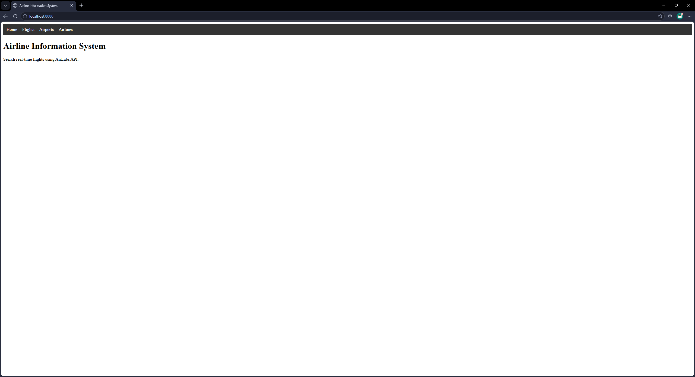
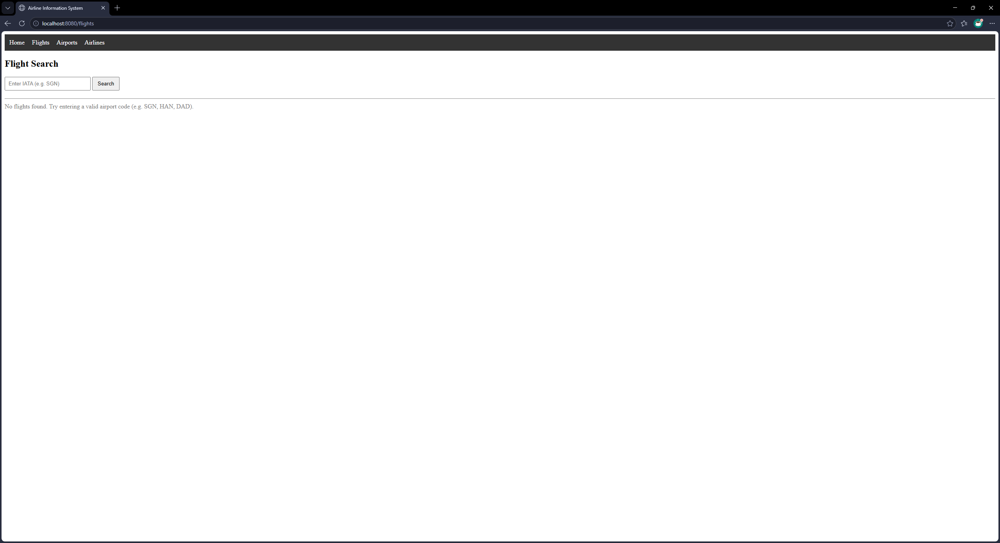
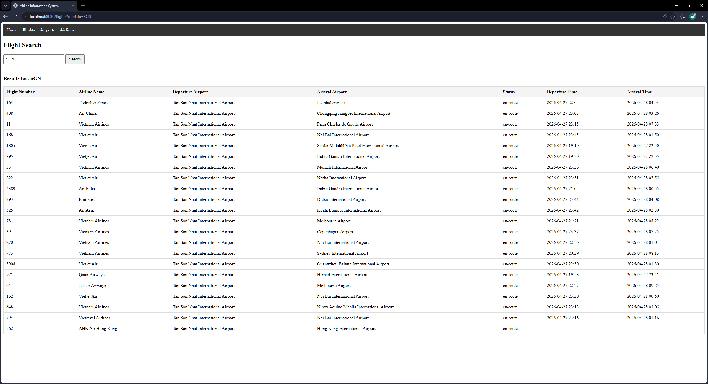
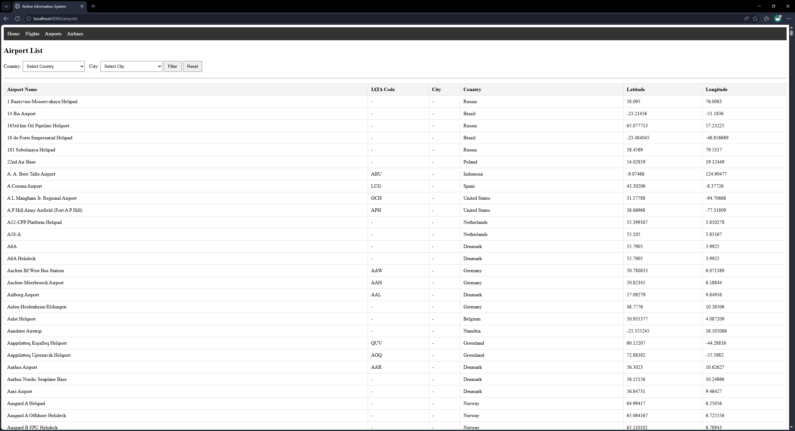
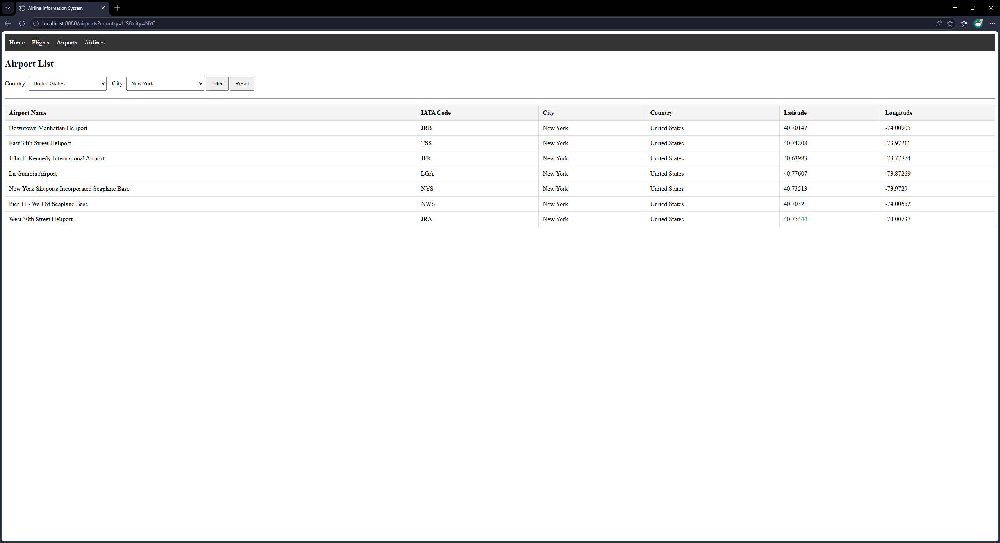
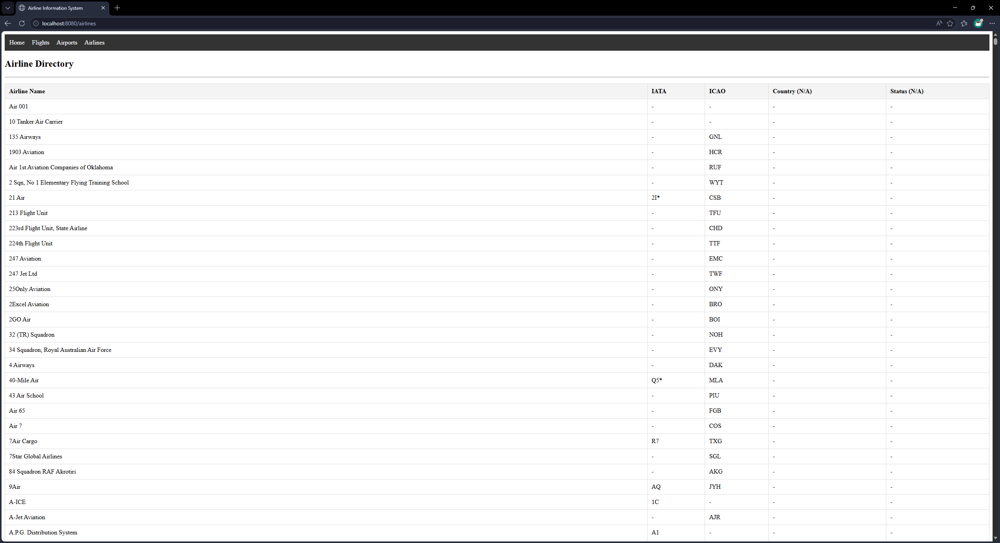
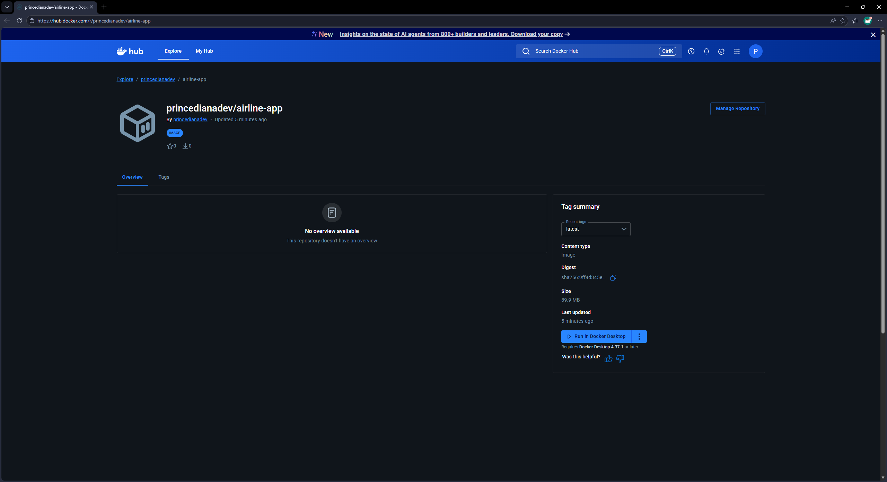

# ✈ Airline Information System

## 📌 Project Description

A Spring Boot web application that integrates with the **AirLabs API** to display real-time flight, airport, and airline data.  
Built using Spring Boot, Thymeleaf, and Docker with external API integrations for live aviation data.

---

## ⚙️ How to Run Locally

### 1. Clone Repository

```
git clone https://github.com/your-username/airline-app.git
cd airline-app
```
### 2. Configure API Key

#### Choose only one properties file to update:

#### 2.1 `application.properties`
```
airlabs.api.key=${AIRLABS_API_KEY:<YOUR_AIRLABS_API_KEY>}
```

OR 

#### 2.2 `application-local.properties`
```
AIRLABS_API_KEY=<YOUR_AIRLABS_API_KEY>
```
### 3. Run Application
#### 3.1 If you used `application.properties` to configure API key:
```
mvn spring-boot:run
```
#### 3.2 If you used `application-local.properties` to configure API key:
```
mvn spring-boot:run -Dspring-boot.run.profiles=local
```

Access:
```
http://localhost:8080
```
---

## 🐳 How to Run with Docker 

### 1. Build Docker Image

Run the following command in the project root directory (where the Dockerfile is located):

```
docker build -t airline-app .
```

### 2. Run Docker Container

Replace `YOUR_AIRLABS_API_KEY` with your actual AirLabs API key.

```
docker run -p 8080:8080 -e AIRLABS_API_KEY=YOUR_AIRLABS_API_KEY airline-app
```

### 3. Open Application

After the container starts successfully, open your browser:

```
http://localhost:8080
```

---

## 🖼️ Screenshots

### Home Page


### Flights Page




### Airports Page




### Airlines Page


---

## 🐳 Docker Hub Image URL
https://hub.docker.com/r/princedianadev/airline-app


